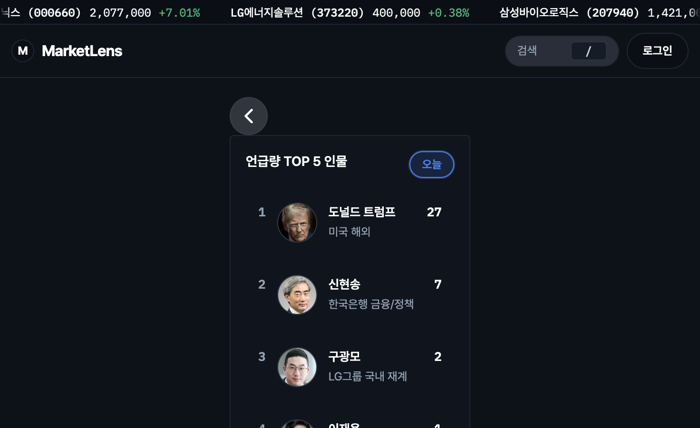
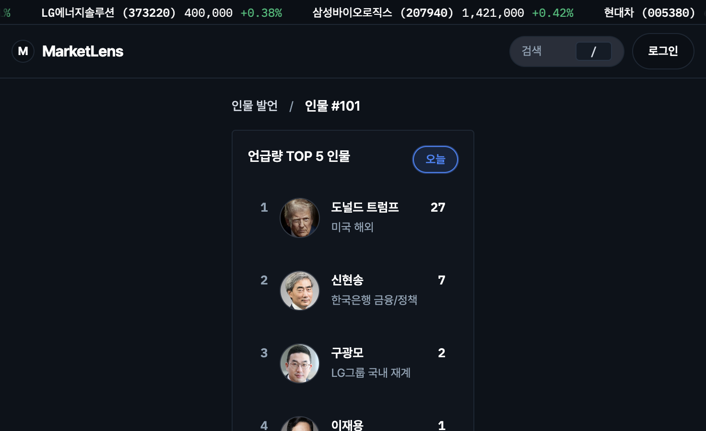
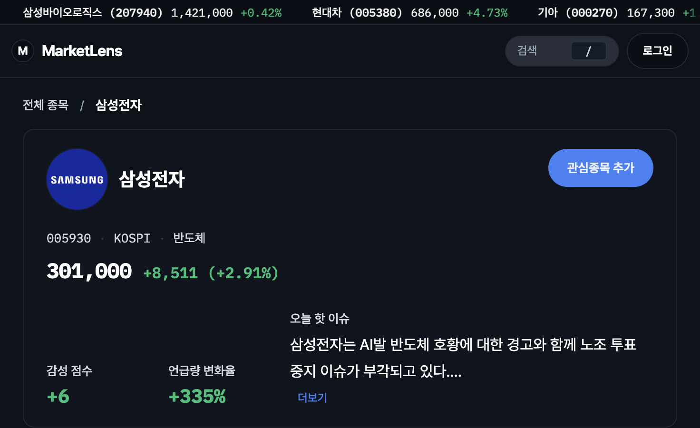
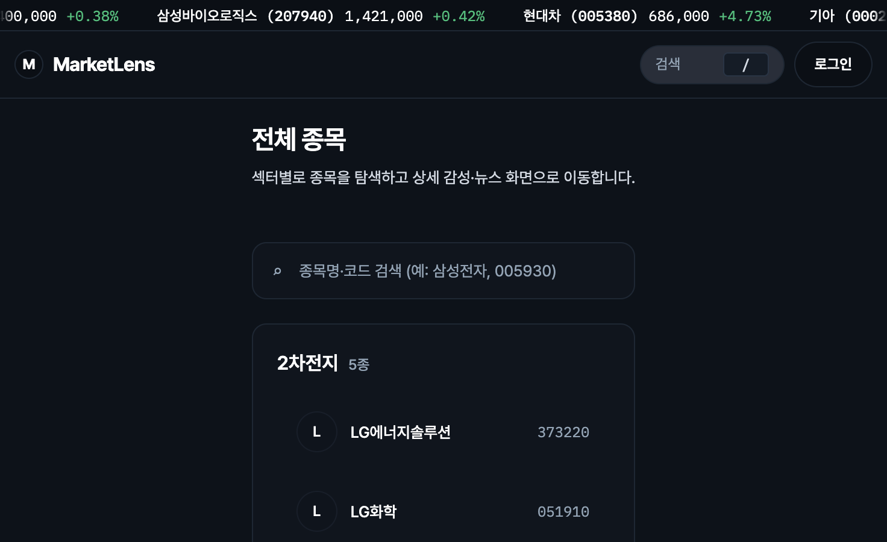

# DDR-0002: 상세 화면 뒤로가기(‹) → 브레드크럼

## 상태
완료 (post-merge)

## 날짜
2026-05-26

## Related Issue
- (해당 시 추가)

## Related PR
- (해당 시 추가)

## 맥락

- **종목** 탭에 **전체 종목(`/stock`)** 목록을 두고, 기존 **종목 상세(`/stock/:code`)** 와 같은 대분류 아래에서 분기하기로 했다. 인물은 이미 **`/person`(목록) · `/person/:id`(상세)** 구조였다.
- 인물 상세는 이전에 좌열 **`PersonTimelineBackButton`(원형 ‹)** 으로 `/person`으로만 돌아갔다. [person-pages changelog](../changelog/2026-05-22-feat-design-refresh-person-pages.md)에서 3열 카드 상단 정렬을 위해 **`--person-detail-panel-offset`(40px + gap)** 과 뒤로가기 **`absolute`** 배치를 썼다.
- ‹ 버튼은 **목적지 라벨이 없고**, 좌측 TOP5 패널 안에 묶여 있어 **“어디로 가는지”** 가 약했다. 종목 목록 도입 후에는 **목록 ↔ 상세** 관계를 UI에 드러내는 편이 맞다.

## 결정

1. **공통 `Breadcrumb` 컴포넌트** (`src/components/common/Breadcrumb.tsx`)를 두고, 상세 페이지 상단에 배치한다.
2. **인물 상세**: `인물 발언` → `{인물명}` (`/person` 링크 + 현재 페이지).
3. **종목 상세**: `전체 종목` → `{종목명}` (`/stock` 링크 + 현재 페이지).
4. 인물 상세의 **좌열 ‹ 버튼·offset 정렬 해크**는 제거한다. 3열 그리드는 브레드크럼 아래에서 동일 `padding-top` 없이 정렬한다.
5. 상단 **종목** 탭·사이드바 **종목 검색** 진입점은 **`/stock`(목록)** 으로 통일한다. 목록·상세 모두 “종목” 탭 active.

## 색·타이포 (2026-05-26)

| 요소 | 토큰 | 의도 |
|------|------|------|
| 부모 링크 | `--color-text-primary` | 경로 안내 — 본문과 같은 흰색 |
| 부모 호버·focus | `--color-primary` | 상단 탭 active·`PillButton` primary와 동일 — 클릭 가능 |
| 현재 페이지 | `--color-primary` + lg/semibold | 지금 보는 리소스 강조 |
| 구분자 `/` | `--color-text-muted` | 계층만 구분, 시선은 링크·현재에 |

구현: `src/components/common/Breadcrumb.module.css` · 상세: [changelog/2026-05-26-style-breadcrumb-colors.md](../changelog/2026-05-26-style-breadcrumb-colors.md)

## 왜 ‹ 대신 브레드크럼인가

| ‹ (이전) | 브레드크럼 (이후) |
|----------|-------------------|
| “한 단계 뒤”만 암시 | **부모 화면 이름**(`인물 발언`, `전체 종목`)이 보임 |
| 좌열 패널 안에 겹쳐 배치 | 본문 **전체 너비 상단** — 3열 레이아웃과 분리 |
| 목록·상세 IA와 무관한 아이콘 | **탭 대분류와 같은 라벨**로 목록 페이지와 연결 |
| 카드 정렬을 위한 offset CSS 필요 | 상단 한 줄 내비로 단순화 |

즉, **2단 라우트(목록 + 상세)** 가 생기면서 “뒤로”보다 **“지금 어디 계층인지 + 목록으로 가기”** 가 더 중요해졌기 때문이다. 인물·종목 **같은 패턴**을 쓰면 탭 안에서 학습 비용도 줄어든다.

## 구현 위치 (참고)

| 구분 | 경로 |
|------|------|
| 스타일·크기 | `src/components/common/Breadcrumb.module.css` |
| 인물 상세 삽입 | `src/pages/PersonDetailPage.tsx` |
| 종목 상세 삽입 | `src/components/stock/StockDetailContent.tsx` |
| 목록 라우트 | `src/pages/StockListPage.tsx`, `src/router/index.tsx` (`/stock`) |
| 경로 헬퍼 | `src/lib/buildStockRoute.ts`, `src/lib/buildPersonRoute.ts` |

## 근거 스냅샷

촬영: 로컬 `npm run dev` (mock), 뷰포트 1440×900 — `docs/snapshots/2026-05-26/`

### 변경 전 (인물 상세 — 좌열 ‹)
좌측 TOP5 위에 원형 뒤로가기만 있고, 부모 화면 이름은 툴팁에만 의존했다.

원본: [01-person-detail-back-button.png](../snapshots/2026-05-26/01-person-detail-back-button.png)

### 반영 후 — 인물 상세 (브레드크럼)
그리드 위 `인물 발언 / {이름}`.

원본: [02-person-detail-breadcrumb.png](../snapshots/2026-05-26/02-person-detail-breadcrumb.png)

### 반영 후 — 종목 상세·목록
종목 상세 `전체 종목 / {종목명}`, 탭 진입 목록 `/stock`.

원본: [03-stock-detail-breadcrumb.png](../snapshots/2026-05-26/03-stock-detail-breadcrumb.png)

원본: [04-stock-list.png](../snapshots/2026-05-26/04-stock-list.png)

## 결과

- 목록·상세 **계층이 URL·UI 라벨과 일치**한다.
- 인물 상세 **offset + absolute 뒤로가기** 레이아웃 부채를 제거했다.
- 종목·인물 상세 **내비 패턴 통일**.

## 트레이드오프

- 본문 **세로 공간**이 브레드크럼 한 줄만큼 늘어난다.
- ‹는 “무조건 이전 화면”에 가깝고, 브레드크럼 부모는 **고정 목록 URL**이다(브라우저 히스토리와 다를 수 있음). 의도적으로 **IA 우선**을 택했다.

## 관련 문서

- [changelog/2026-05-22-feat-design-refresh-person-pages.md](../changelog/2026-05-22-feat-design-refresh-person-pages.md) — 이전 ‹ + offset 정렬
- [ui-product-overview.md](../design/ui-product-overview.md) — 종목 상세 (`/stock/:code`) (목록 섹션은 추후 개요 갱신 권장)
