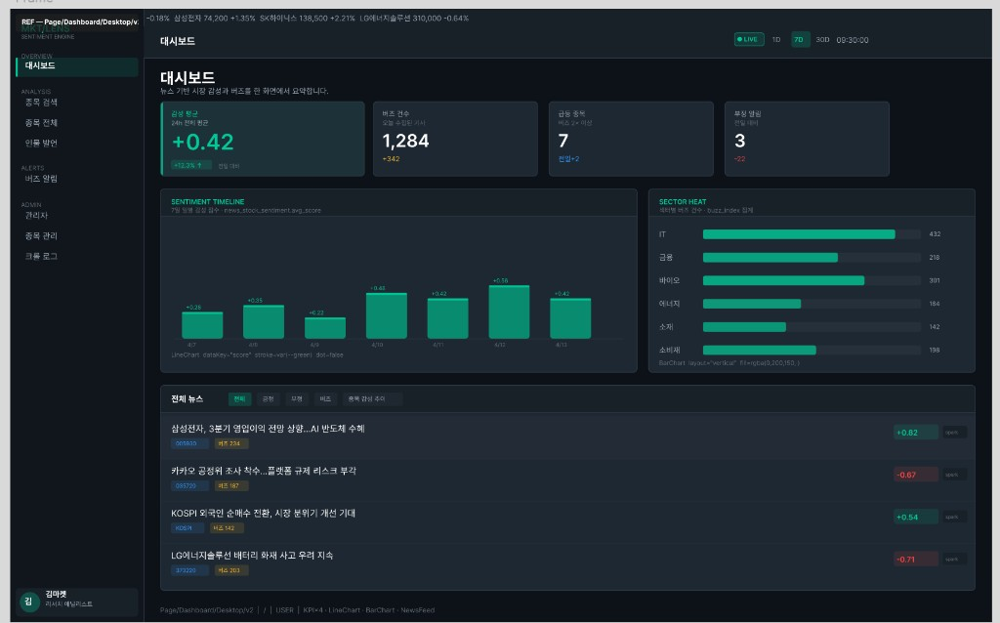
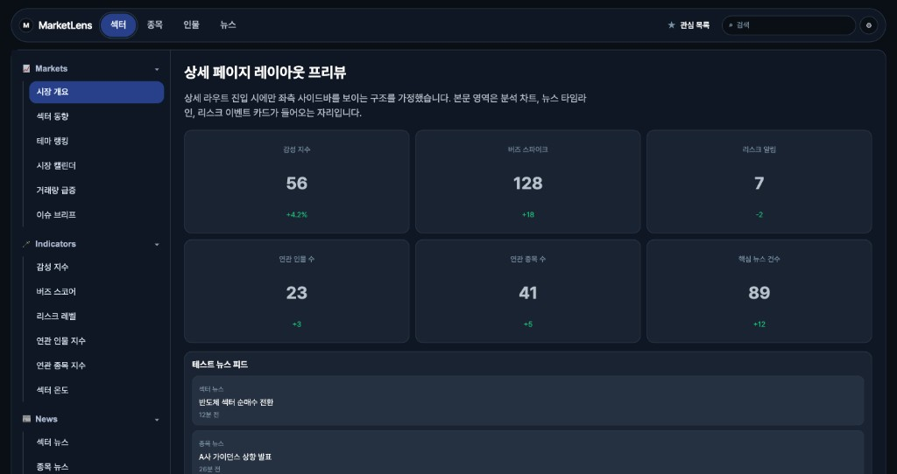
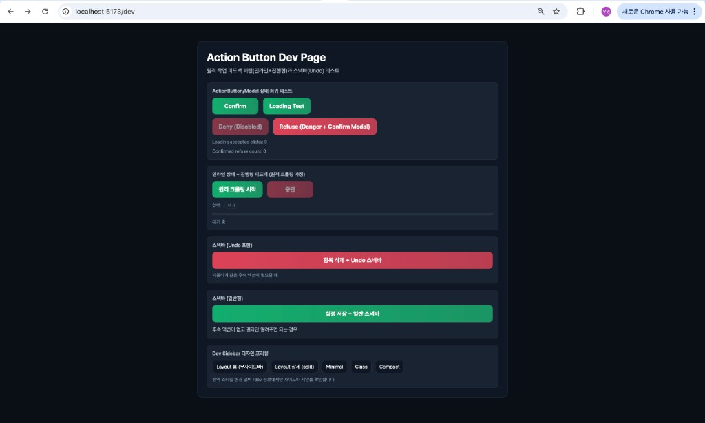
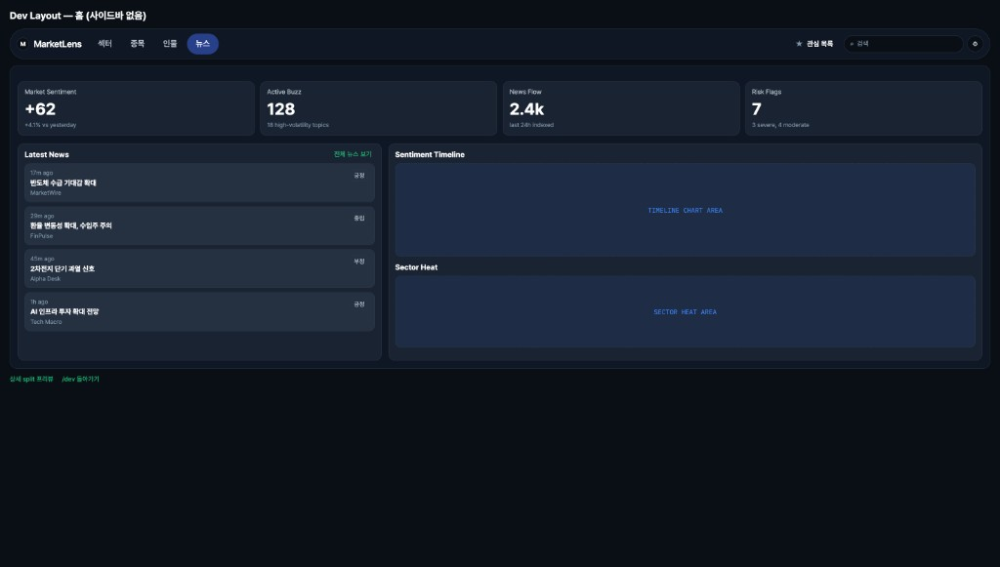
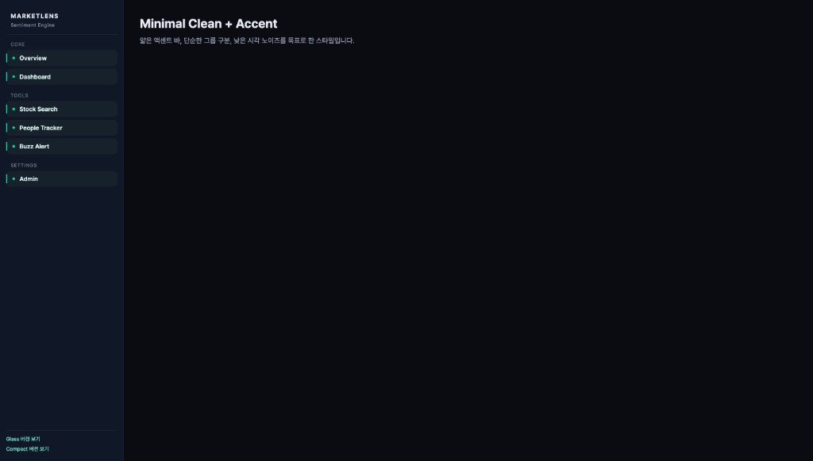
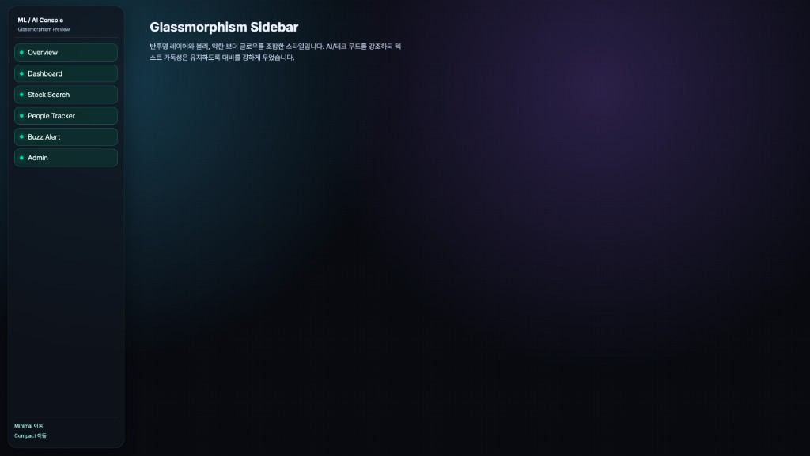
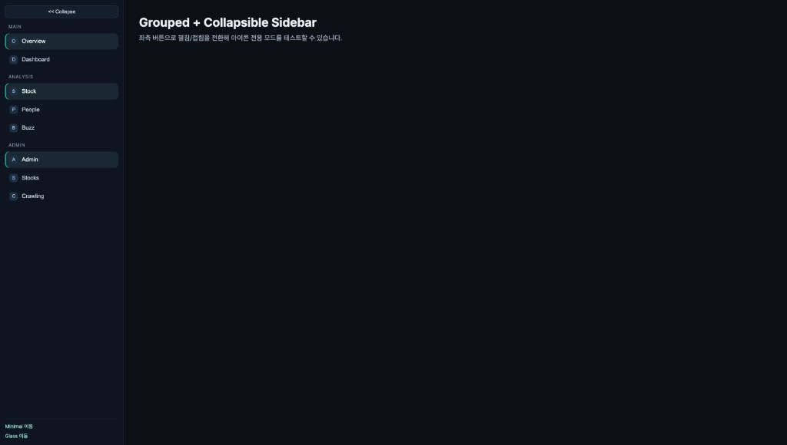
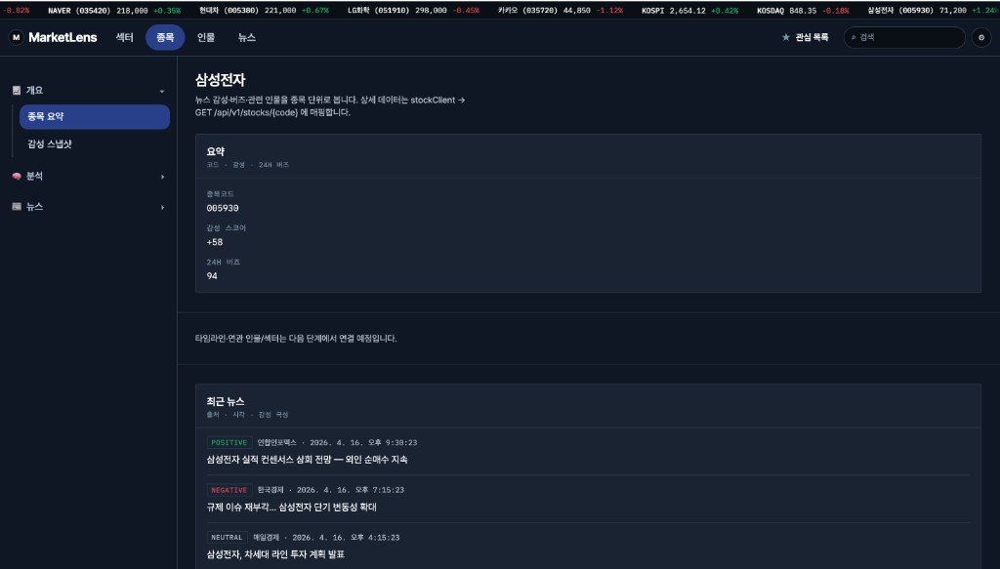

# Dev Sidebar Migration Log

이 문서는 사이드바 도입 과정을 "실페이지 기준 -> Dev 실험 -> 실페이지 반영" 순서로 추적합니다.

## 1) 기준 상태 (Before)

**근거 스냅샷**
- `docs/snapshots/2026-04-16/01-before-real.png`



**관찰 내용**
- 기존 실페이지는 대시보드 중심 구성으로, 정보 밀도는 높지만 라우트별 탐색 구조가 약함.
- 좌측 내비게이션은 있었지만 상세 페이지 정보 구조와 직접 연결된 사이드바 패턴은 부족함.

## 2) Dev 실험 단계

### 2-1. 사이드바 실험 화면

**근거 스냅샷**
- `docs/snapshots/2026-04-16/02-dev-page.png`



**실험 포인트**
- 상세 모드에서 섹션 그룹(시장/지표/뉴스) 기반 사이드바 탐색
- 메뉴 클릭 시 본문 섹션 이동
- 스크롤 위치에 따른 active 항목 동기화

### 2-2. Dev 메인 실험 허브

**근거 스냅샷**
- `docs/snapshots/2026-04-16/04-dev-main.png`
- `docs/snapshots/2026-04-16/05-home-top-nav.png`




**실험 포인트**
- 액션/상태 전환 UI를 Dev 허브에서 빠르게 검증
- 홈 Top Navigation과 상세 사이드바 패턴을 분리 검증

### 2-3. 사이드바 스타일 변형 실험

**근거 스냅샷**
- `docs/snapshots/2026-04-16/06-sidebar-minimal.png`
- `docs/snapshots/2026-04-16/07-sidebar-glow.png`
- `docs/snapshots/2026-04-16/08-sidebar-compact.png`





**실험 포인트**
- Minimal: 가독성/정보 위계 우선
- Glow: 시각 임팩트 우선
- Compact: 공간 효율 + 그룹/접기 상호작용

## 3) 반영 상태 (After)

**근거 스냅샷**
- `docs/snapshots/2026-04-16/03-after-real.png`



**반영 결과**
- 상세 페이지에 사이드바 내비게이션 패턴 반영
- 탐색 단위가 페이지 기준에서 "섹션 기준"으로 확장됨
- Dev에서 검증한 상호작용 흐름을 실페이지에 이관

## 4) 결정 근거 요약 (DDR 입력용)

- **맥락**
  - AI 기반 빠른 구현에서 중복 컴포넌트/스타일 일관성 문제 발생
  - 실페이지에서 직접 실험 시 회귀 리스크 증가
- **결정**
  - Dev 페이지에서 UI/상호작용 선검증 후 공통화/실반영
- **결과**
  - Before -> Dev -> After 증거 체인 확보
  - PR/DDR에서 판단 근거를 이미지로 추적 가능

## 5) PR 템플릿에 넣을 문구

```md
## Evidence
- Before: `docs/snapshots/2026-04-16/01-before-real.png`
- Dev Experiment: `docs/snapshots/2026-04-16/02-dev-page.png`
- After: `docs/snapshots/2026-04-16/03-after-real.png`

## Related
- Refs: DDR-0001
- Related Issue: #7
```
