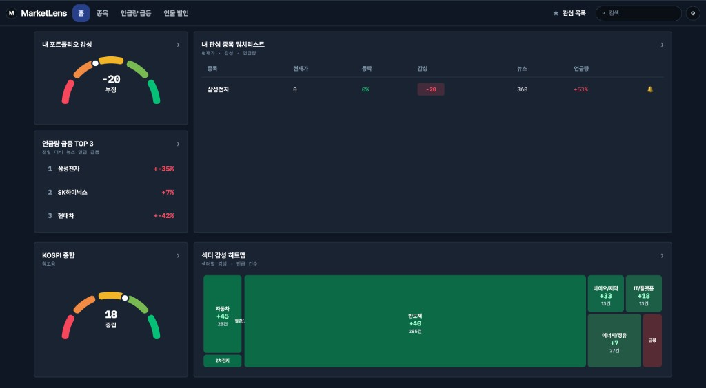
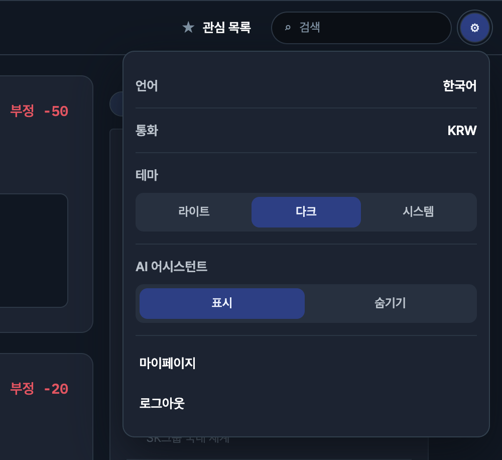
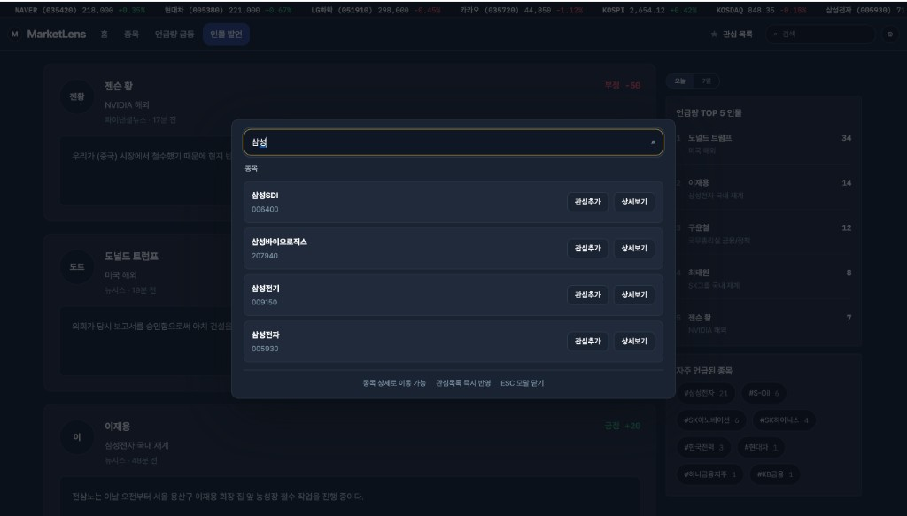
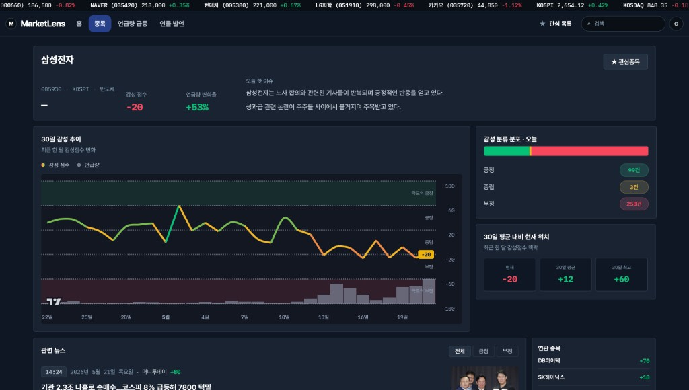
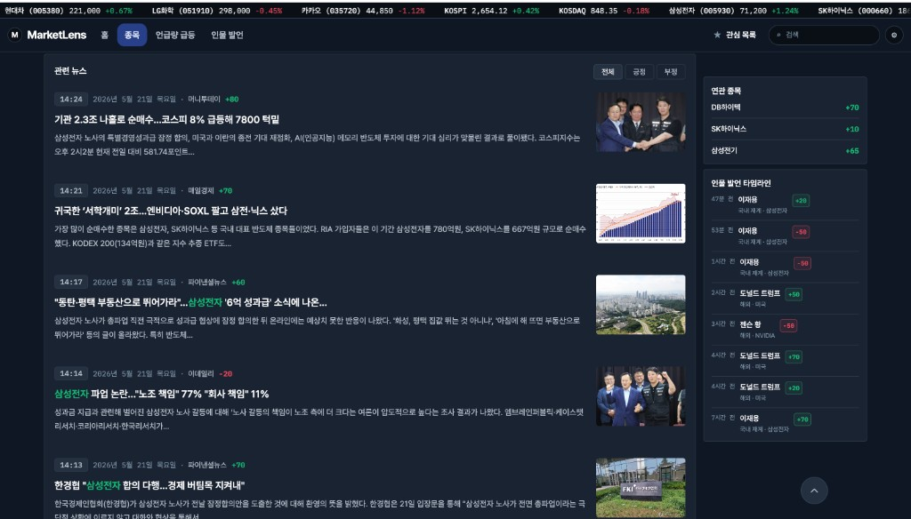
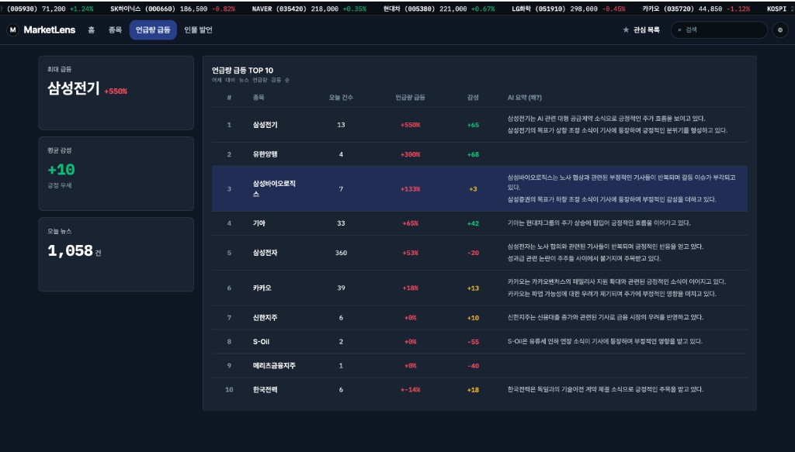
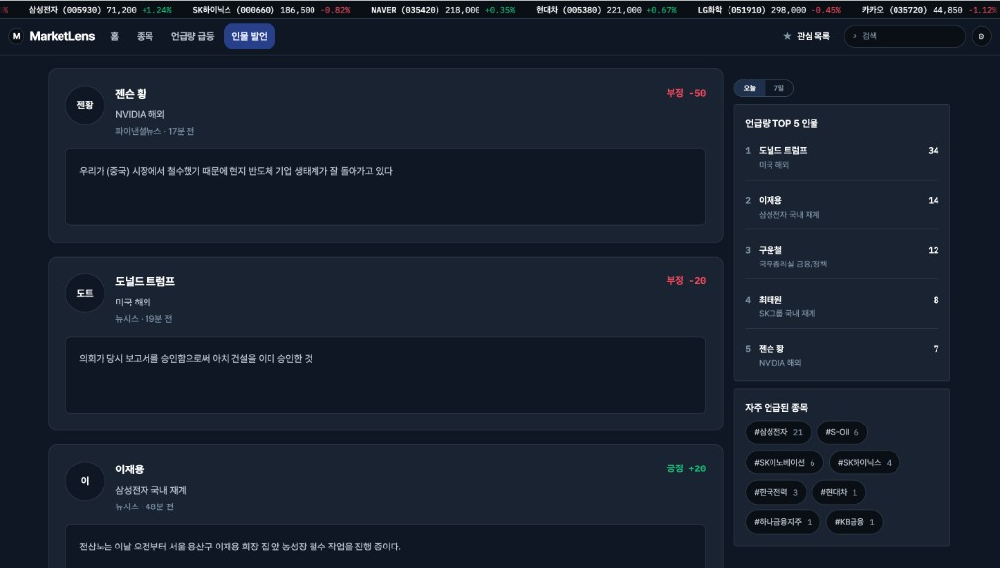
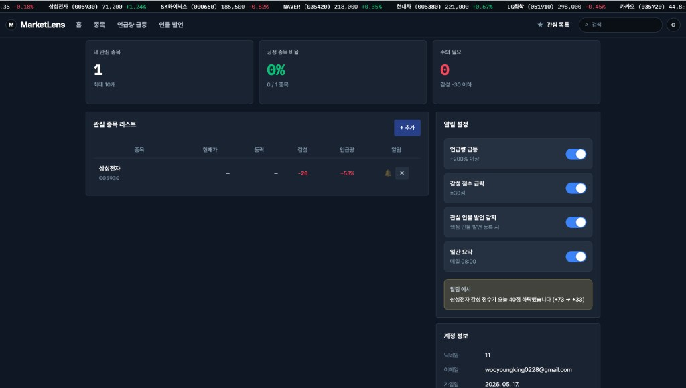

# MarketLens UI · 디자인 리프레시 이전 베이스라인 (2026-05-21)

**목적:** `feat/design-refresh` 작업 전 **실서비스에 가까웠던 UI**를 스크린샷·IA 기준으로 보관한다.  
**후속 작업:** 검색 모달 탭·스켈레톤 로딩·토큰 정리 등은 이 스냅샷 이후 변경되므로, Before/After 비교 시 이 문서를 기준으로 삼는다.

| 항목 | 내용 |
|------|------|
| 캡처 일자 | 2026-05-21 |
| 테마 | 다크 모드 고정(설정에서 라이트·시스템 선택 가능) |
| 관련 문서 | [ui-product-overview.md](../../design/ui-product-overview.md) (현재 제품 서술) |

---

## 스크린샷 인덱스

| # | 파일 | 라우트·상태 | 요약 |
|---|------|-------------|------|
| 01 | [01-home-dashboard.png](./01-home-dashboard.png) | `/` · 홈 | 포트폴리오 게이지·워치리스트·섹터 히트맵 |
| 02 | [02-stock-detail.png](./02-stock-detail.png) | `/stock/005930` · 종목 | 삼성전자 상단·30일 차트·사이드 위젯 |
| 03 | [03-stock-detail-news.png](./03-stock-detail-news.png) | `/stock/:code` · 하단 | 관련 뉴스·연관 종목·인물 타임라인 |
| 04 | [04-search-modal.png](./04-search-modal.png) | 전역 · 검색 모달 | `삼성` 검색 결과(종목만) |
| 05 | [05-settings-dropdown.png](./05-settings-dropdown.png) | 전역 · 설정 | 언어·통화·테마·AI 어시스턴트 |
| 06 | [06-person-tracker.png](./06-person-tracker.png) | `/person` · 인물 발언 | 발언 카드 피드 + 우측 랭킹 |
| 07 | [07-buzz-surge.png](./07-buzz-surge.png) | `/buzz` · 언급량 급등 | TOP 10 테이블 + 좌측 요약 카드 |
| 08 | [08-mypage.png](./08-mypage.png) | `/mypage` · 마이페이지 | 관심 종목·알림·계정 정보 |

---

## 1. 공통 셸



### 상단 구조

1. **티커 바 (최상단)** — SK하이닉스·NAVER·현대차·LG화학·카카오·KOSPI·KOSDAQ·삼성전자 등. 등락은 녹색(상승)/적색(하락).
2. **메인 내비** — 좌 `MarketLens` 로고, 중앙 `홈` · `종목` · `언급량 급등` · `인물 발언`, 우 `관심 목록` + **검색 입력**(placeholder `검색`) + **설정(톱니)**.
3. **활성 탭** — 현재 라우트 메뉴는 **파란 배경 pill** 형태로 강조.

### 설정 드롭다운



| 항목 | UI 패턴 | 스냅샷 상태 |
|------|---------|-------------|
| 언어 | 행 + 우측 값 | 한국어 |
| 통화 | 행 + 우측 값 | KRW |
| 테마 | 3분할 세그먼트 | **다크** 선택 |
| AI 어시스턴트 | 2분할 세그먼트 | **표시** 선택 |
| 하단 링크 | 텍스트 행 | 마이페이지, 로그아웃 |

### 검색 모달 (이전 버전)



- **트리거:** 상단 검색창 포커스/입력 시 **화면 중앙**에 모달 오버레이(배경 dim).
- **입력:** 넓은 단일 검색창, **금색 테두리** 강조, 예시 쿼리 `삼성`.
- **결과:** 섹션 제목 `종목` 아래 리스트 — 종목명·티커, 우측 **`관심추가`** · **`상세보기`** 버튼.
- **하단 힌트:** `종목 상세로 이동 가능` · `관심목록 즉시 반영` · `ESC 모달 닫기`.
- **미포함(리프레시 후 추가):** 종목/인물 도메인 탭, `fallbackSections`, prefetch 후 모달 오픈, `/` 단축키 뱃지 등.

---

## 2. 홈 (`/`)


| 영역 | 컴포넌트 | 스냅샷 데이터 예시 |
|------|----------|-------------------|
| 좌 상 | **내 포트폴리오 감성** | 반원 게이지 **-20**, 라벨 `부정` |
| 좌 중 | **언급량 급등 TOP 3** | 삼성전자 +35%, SK하이닉스 +7%, 현대차 -42% |
| 좌 하 | **KOSPI 종합** | 게이지 **18**, `중립` |
| 우 | **내 관심 종목 워치리스트** | 표: 종목·현재가·등락·감성·뉴스·언급량. 삼성전자 감성 **-20**, 뉴스 360, 언급 +53% |
| 하단 | **섹터 감성 히트맵** | Treemap — 반도체 +40(285건), 자동차 +45, 바이오 +33, IT +18, 에너지 +7, 금융(적색 소형) |

**레이아웃:** 2열(좌 지표 스택 / 우 테이블) + 하단 히트맵 풀폭.

---

## 3. 종목 상세 (`/stock/:code`)

### 상단·차트



| 영역 | 설명 |
|------|------|
| 헤더 | `삼성전자`, 티커 `005930`, KOSPI, 반도체. **감성 -20**(적), **언급량 +53%**(녹). **오늘 핫 이슈** 문단. **관심종목** 버튼 |
| 중앙 좌 | **30일 감성 추이** — Y축 5구간 배경(극도 긍정~극도 부정), 라인 + 하단 언급량 막대, 최근 포인트 강조 |
| 중앙 우 | **감성 분류 분포·오늘** — 긍정 99 / 중립 3 / 부정 258. **30일 평균 대비** — 현재 -20, 평균 +12, 최고 +60 |

### 하단·사이드



| 영역 | 설명 |
|------|------|
| 좌 | **관련 뉴스** — 필터 전체/긍정/부정. 항목: 시각·날짜·매체·감성 점수·제목·요약·썸네일 |
| 우 | **연관 종목** (DB하이텍 +70, SK하이닉스 +10, 삼성전기 +65). **인물 발언 타임라인** (이재용·트럼프·젠슨 황 등) |
| 플로팅 | 우하단 **맨 위로** 버튼 |

**활성 내비:** `종목` 탭.

---

## 4. 언급량 급등 (`/buzz`)



| 영역 | 설명 |
|------|------|
| 좌 카드 | **최대 급등** 삼성전기 +550%. **평균 감성** +10 (긍정 우세). **오늘 뉴스** 1,058건 |
| 메인 | **언급량 급등 TOP 10** 테이블 — #, 종목, 오늘 건수, 급등률(적색), 감성(녹/적), **AI 요약(왜?)** |
| 하이라이트 | 3위 삼성바이오로직스 행 **파란 배경** (호버/선택 상태) |

**활성 내비:** `언급량 급등` 탭.

---

## 5. 인물 발언 (`/person`)



| 영역 | 설명 |
|------|------|
| 메인 | 발언 **카드 리스트** — 아바타·이름·소속·경과 시간·본문·우상단 감성 배지 (예: 젠슨 황 부정 -50, 이재용 긍정 +20) |
| 우 상 | 기간 탭 **오늘** / 7일 |
| 우 | **언급량 TOP 5 인물** 랭킹. **자주 언급된 종목** 해시태그 클라우드 (#삼성전자 21 등) |

**활성 내비:** `인물 발언` 탭. 검색 모달이 열린 상태의 배경은 [04-search-modal.png](./04-search-modal.png) 참고.

---

## 6. 마이페이지 (`/mypage`)



| 영역 | 설명 |
|------|------|
| 상단 카드 3종 | 관심 종목 1/10, 긍정 종목 비율 0%, 주의 필요 0 (감성 -30 이하) |
| 관심 종목 리스트 | 삼성전자 — 감성 -20, 언급 +53%, 알림 벨·삭제, **+ 추가** |
| 알림 설정 | 4개 토글 ON — 언급량 급등, 감성 급락, 관심 인물 발언, 일간 요약 08:00. **알림 예시** 박스 |
| 계정 정보 | 닉네임·이메일·가입일 |

---

## 7. 디자인 리프레시 대비 체크포인트

이 스냅샷 이후 의도적으로 바뀌는 영역(참고용):

| 영역 | 이전(본 문서) | 이후(진행 중) |
|------|---------------|---------------|
| 검색 | 중앙 모달, 종목 리스트만, 즉시 오픈 | 상단 고정, 종목/인물 탭·fallback, prefetch 후 오픈, `/` 단축키 |
| 로딩 | (스크린샷에 없음) 풀 렌더 | 페이지 스켈레톤 + 최소 500ms |
| 내비 탭 | pill 배경 | 밑줄형 `UnderlineTabNav` 등 통일 검토 |
| 문서 | — | [ui-product-overview.md](../../design/ui-product-overview.md) 최신화 |

---

## DDR / PR 참조 예시

```text
Before: docs/snapshots/2026-05-21/04-search-modal.png
After:  (리프레시 후 동일 라우트 재캡처)
Refs: docs/snapshots/2026-05-21/ui-pre-design-refresh.md
```
